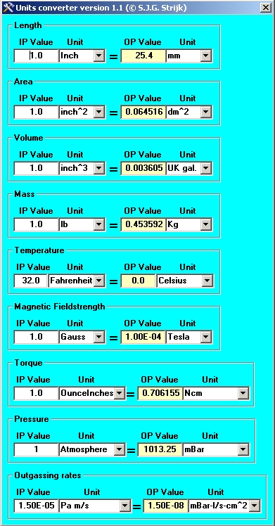



## Units convertor

### Description

An example of an engineering units converter using an universal data entry routine for all input data

allowing scientific data formats.
 
### More Info
 

             |
---                |---
**Submitted On**   |2009-12-10 11:20:02
**By**             |[Simon](https://github.com/Planet-Source-Code/PSCIndex/blob/master/ByAuthor/simon.md)
**Level**          |Advanced
**User Rating**    |5.0 (15 globes from 3 users)
**Compatibility**  |VB 6\.0
**Category**       |[Math/ Dates](https://github.com/Planet-Source-Code/PSCIndex/blob/master/ByCategory/math-dates__1-37.md)
**World**          |[Visual Basic](https://github.com/Planet-Source-Code/PSCIndex/blob/master/ByWorld/visual-basic.md)
**Archive File**   |[Units\_conv21699812102009\.zip](https://github.com/Planet-Source-Code/simon-units-convertor__1-72727/archive/master.zip)

